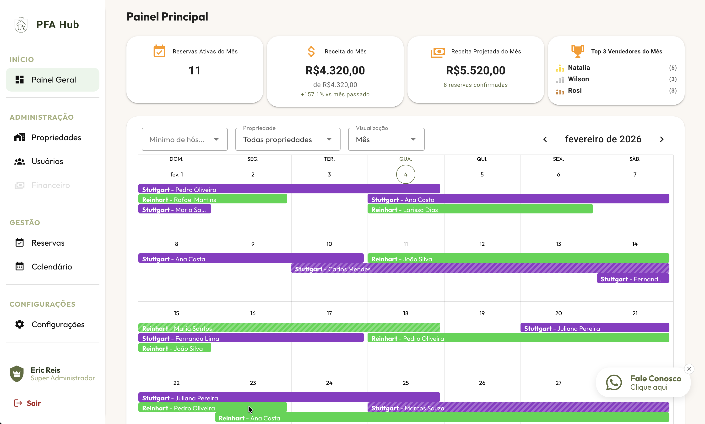
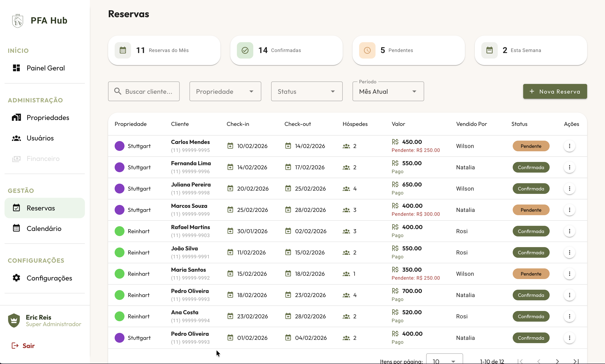
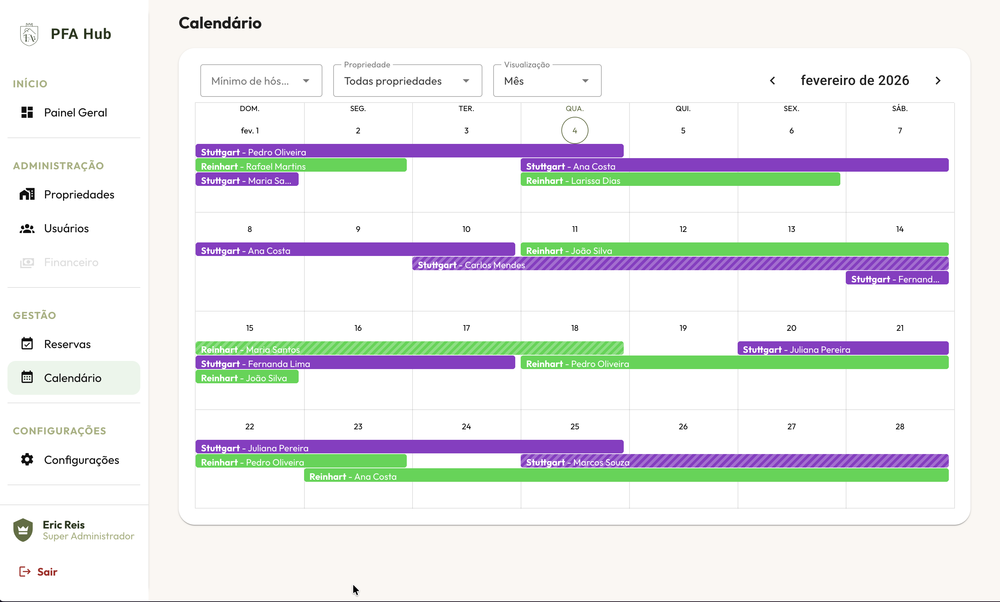
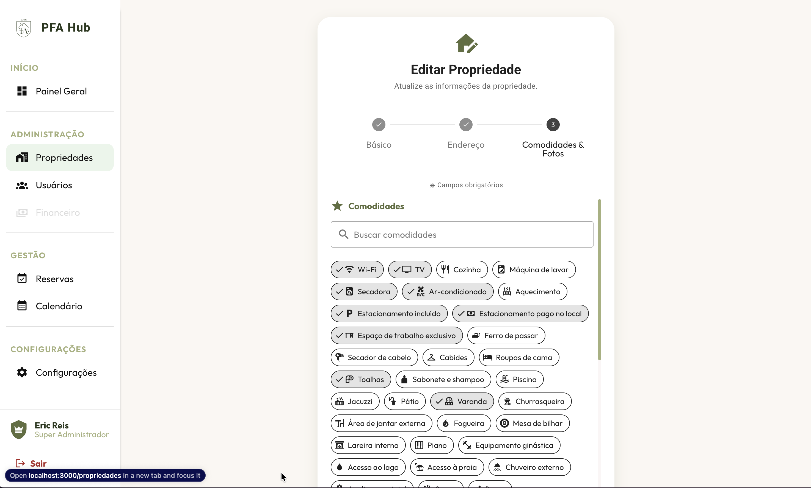
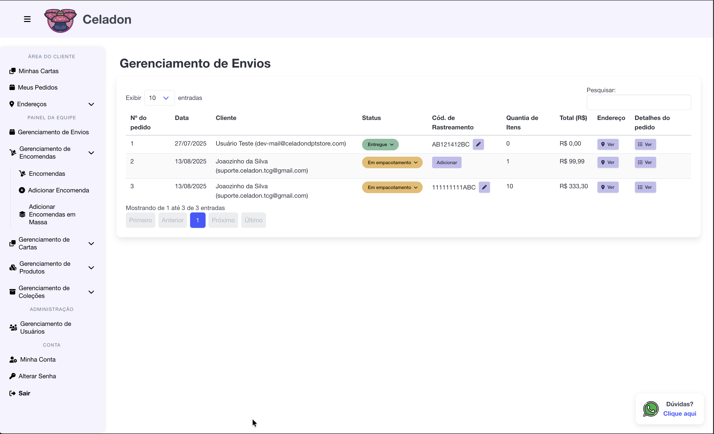
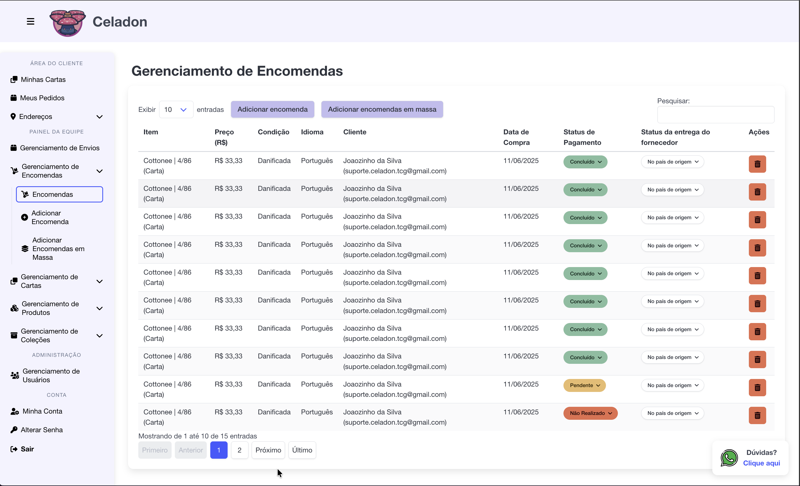
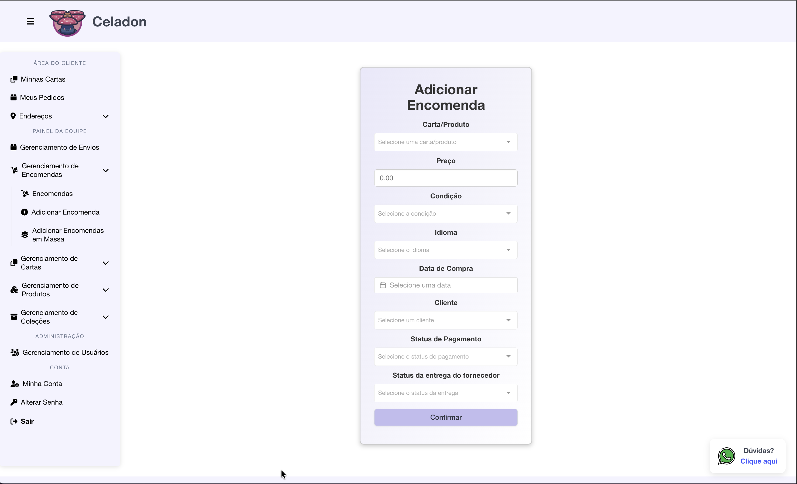

[](https://git.io/typing-svg)

**Currently Head of Development at P3rformar** with 3+ years of experience building web systems, APIs, and third-party integrations. I lead the dev team on technical decisions, mentor developers, and work as the senior engineer responsible for delivering products end-to-end — from architecture and backend to frontend and cloud infrastructure.

<p align="left">
  <a href="https://ericreis.dev">
    
  </a>
  <a href="https://linkedin.com/in/eric-mreis">
    
  </a>
</p>

## 🛠️ Tech Stack

```javascript
const eric = {
    backend: ["Python", "Django", "FastAPI", "Node.js", "Fastify"],
    frontend: ["Vue.js", "TypeScript", "JavaScript", "Vite", "Pinia"],
    ui_kits: ["Vuetify", "DaisyUI", "Bulma", "Bootstrap", "TailwindCSS", "SCSS"],
    databases: ["PostgreSQL", "Redis", "SQLAlchemy", "Alembic", "Sequelize"],
    cloud: ["AWS (EC2, S3, RDS, CloudFront, Route53, IAM)", "Docker", "GitHub Actions", "NGINX", "PM2", "Supervisor"],
    testing: ["Pytest", "Vitest"],
    monitoring: ["Sentry", "New Relic", "Uptime Robot"],
    tools: ["ClickUp", "Git", "GitHub", "Bitbucket", "Insomnia"],
    computer_vision: ["OpenCV", "YOLOv8"],
    currently_learning: "TypeScript"
};
```

**Backend**  


**Frontend**  


**Cloud & DevOps**  


**Tools & Workflow**  


## 🏆 Certifications

- [ClickUp Certified Admin](https://verify.skilljar.com/c/d6747ictzfvr)
- [ClickUp Certified Expert](https://verify.skilljar.com/c/w45vtp22qbwa)

## 🚀 Featured Projects

### 🏠 PFA Hub — Property Management System
> 🚧 **In Development** — A complete reservation management platform for vacation rentals and properties, inspired by Airbnb-style hosting needs.

Built from a real need: a friend with multiple properties and chalets struggled to manage everything at once. This system solves that.


**Planned:** Mercado Pago payment integration microservice (in progress)

⚡ *Built in less than 1 month, mostly on weekends*

<p align="center">
  
</p>

<details>
<summary>📸 More Screenshots</summary>

<br>

**Login**


**Dashboard — KPIs & Calendar Overview**



**Reservations Management**



**Calendar View**



**Property Amenities**



</details>

### 🎴 Celadon DPT Store — Pokémon Card Management
> Complete system for one of Brazil's largest Pokémon card resellers — managing products, sales, shipments, and customers.

Built from scratch in 3 months as a freelance project. Full ownership of frontend, backend, and deployment.


**Features:** 4,800+ cards catalogued · Order tracking · Customer management · Role-based access

<p align="center">
  
</p>

<details>
<summary>📸 More Screenshots</summary>

<br>

**Shipment Management**



**Order Management**



**Add Order Form**



</details>

## 💼 Work Activity

For my professional contributions, check out my work profile: **[@eric-p3](https://github.com/eric-p3)**

## ⚡ Fun Facts

- 🔧 Started as a hardware guy — discovered my passion for programming through Python in college and never looked back
- 🎓 Electronics Engineering background (finishing in 2026)
- 🏃 Decided to run a marathon in 2025, trained for 8 months (1,050+ km), and finished in 4h30m — really painful but life-changing
- 🎌 Passed the JLPT N4 Japanese proficiency exam in just 3 months of studying (anime and manga die hard fan)
- 🐱 Proud cat dad of Lebron James (black cat) and Kiana (thai cat)

<p align="center">
  
  
</p>

---

<p align="center">
  <sub>📍 Florianópolis, Brazil</sub>
</p>

<p align="center">
  <b>Contact me</b>
</p>

<p align="center">
  <a href="https://ericreis.dev">
    
  </a>
  <a href="https://linkedin.com/in/eric-mreis">
    
  </a>
</p>
